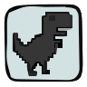

##  &nbsp;about me
 &nbsp; computer science @ TU Dublin
 &nbsp; originally from brazil, currently based in ireland

## things i've built

**aula** is a flask + sqlite app i built for fáilte isteach, the volunteer org where i teach conversational english. it handles class scheduling, rsvps, attendance, and announcements for coordinators and students, and it's designed to eventually be a multilingual pwa so it works for people who aren't fluent in english yet.

**dev.uicr.org** is where i do ongoing volunteer web development, mostly wordpress and php. i built out the member countries page from scratch (custom post type, continent-grouped flag grid, the whole thing), and i try to keep every solution simple enough that non-technical staff can maintain it after i'm gone.

i also freelance on the side, small wordpress builds, landing pages, the occasional "please just fix this" job.

## right now

i'm a notion campus leader and a peer mentor at TU Dublin starting this september, on top of the fáilte isteach volunteering. busy semester ahead.

## what i work with

python, c, javascript, html/css, flask, wordpress, php, sql. still learning, always will be.

## outside of code

photography, drawing, film. i'm slowly getting into hardware and electronics, and trying to build up my financial literacy too because nobody teaches you that in school.

## languages

portuguese (native), spanish, english, and i'm learning korean.